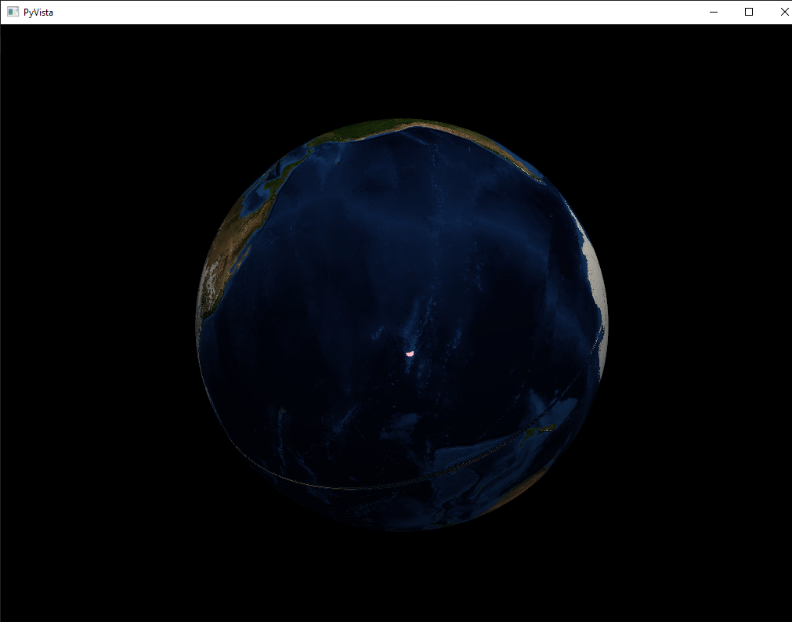
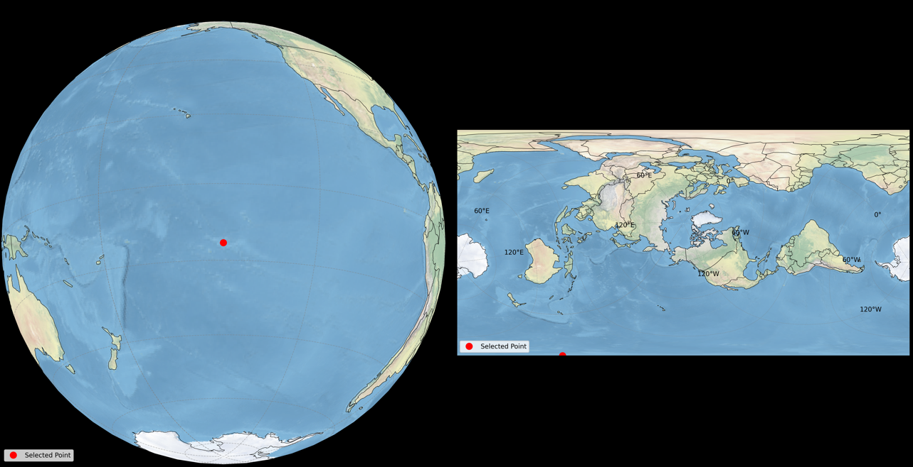

# Earth Viewer

An interactive 3D Earth globe viewer with dynamic 2D map projection capabilities. Click anywhere on the 3D globe to generate corresponding 2D map projections.




## Features

- Interactive 3D Earth globe with high-resolution NASA Earth texture
- Click-to-project functionality
- Automatic projection selection based on clicked location:
  - Polar stereographic projection for polar regions (>60° latitude)
  - Robinson projection for other areas
- Real-time coordinate conversion and display
- High-quality coastline rendering
- Grid overlay support

## Installation

1. Clone the repository:
```bash
git clone https://github.com/4n4c0nd4RSA/earth-viewer.git
cd earth-viewer
```

2. Install the required dependencies:
```bash
pip install -r requirements.txt
```

### System Dependencies

Depending on your operating system, you might need to install additional system libraries:

#### Ubuntu/Debian
```bash
sudo apt-get install python3-dev proj-bin libproj-dev libgeos-dev
```

#### MacOS (using Homebrew)
```bash
brew install proj geos
```

#### Windows
Install Visual C++ Build Tools and use conda for Cartopy:
```bash
conda install cartopy
```

## Usage

1. Run the main script:
```bash
python earth_viewer.py
```

2. The application will open showing a 3D Earth globe.
3. Click anywhere on the globe to:
   - See the latitude and longitude coordinates in the console
   - Open a new window with a 2D map projection centered on the clicked point
4. Close the windows to exit the application

## Requirements

- Python 3.8+
- See `requirements.txt` for Python package dependencies

## Project Structure

```
earth-viewer/
│
├── earth_viewer.py      # Main application file
├── requirements.txt     # Python dependencies
├── LICENSE             # MIT license
└── README.md           # This file
```

## Contributing

Contributions are welcome! Please feel free to submit a Pull Request.

## License

This project is licensed under the MIT License - see the [LICENSE](LICENSE) file for details.

## Acknowledgments

- Earth texture from NASA Earth Observatory
- Built with PyVista, Cartopy, and Matplotlib
- Thanks to all contributors and the open-source community

## Author

4n4c0nd4RSA

## Support

If you encounter any problems or have suggestions, please open an issue on the GitHub repository.